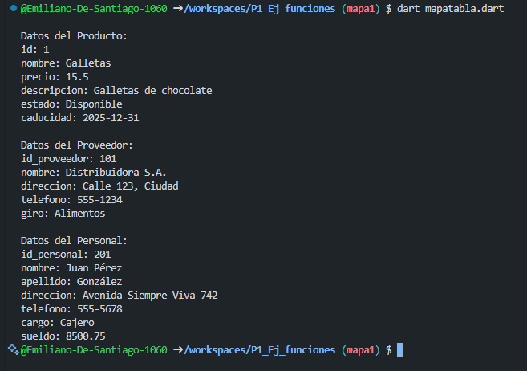

## Instrucciones

- Crea un programa en Dart que utilice `Map<String, dynamic>`.
- Define tres mapas: `producto`, `proveedor` y `personal`.
- Ingresa cada atributo de cada entidad uno por uno en los mapas.
- Cada mapa debe contener claves y valores que representen los datos de cada entidad.
- Muestra en la consola los datos de cada mapa.

### Atributos

- **Producto**: `id`, `nombre`, `precio`, `descripcion`, `estado`, `caducidad`
- **Proveedor**: `id_proveedor`, `nombre`, `direccion`, `telefono`, `giro`
- **Personal**: `id_personal`, `nombre`, `apellido`, `direccion`, `telefono`, `cargo`, `sueldo`

