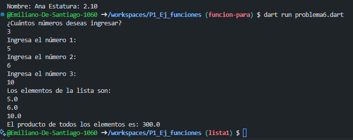

- Desarrolla un programa que tome una lista de números decimales (double) y calcule el producto de todos sus elementos. que utilice 2 funciones una para capturar datos de la lista y otra para mostrar los elementos en dart.

- 